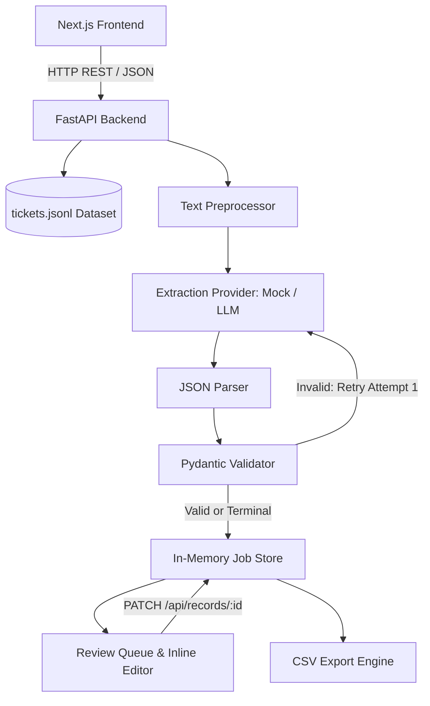

# Extraction Workbench

Human-in-the-loop triage and structured extraction workbench for incoming customer support tickets.

> 🚀 **Live Production Deployment**:
> - **Frontend (Next.js / Vercel)**: [https://oraczen-extraction-workbench-six.vercel.app](https://oraczen-extraction-workbench-six.vercel.app)
> - **Backend API (FastAPI / Render)**: [https://oraczen-extraction-workbench.onrender.com](https://oraczen-extraction-workbench.onrender.com)
> - **Interactive Swagger Docs**: [https://oraczen-extraction-workbench.onrender.com/docs](https://oraczen-extraction-workbench.onrender.com/docs)
> - **Health Check**: [https://oraczen-extraction-workbench.onrender.com/health](https://oraczen-extraction-workbench.onrender.com/health)

---

## 1. Overview

Customer support channels receive unstructured, noisy messages across email, web forms, live chat, and phone transcripts. Downstream CRM and issue-tracking systems require clean, structured records (`company`, `product`, `category`, `severity`, `requested_action`, `refund_amount`, `deadline`, `escalated`).

Relying entirely on autonomous LLM extraction leads to silent failures: models hallucinate unstated severities, guess currency conversions, and invent facts when messages are near-empty. 

**Extraction Workbench** solves this with a **human-in-the-loop** pipeline:
1. Ingests raw customer support tickets.
2. Cleans text via deterministic preprocessing (stripping quoted chains, disclaimers, and footers).
3. Invokes an extraction provider (deterministic mock by default).
4. Strictly validates extracted payloads against Pydantic schemas.
5. Automatically retries malformed outputs once with corrective validation feedback.
6. Categorizes items into `done`, `needs_review`, or `failed`.
7. Routes uncertain, ungrounded, or ambiguous records to a human review interface where operators can inspect evidence, address flags, correct fields, or trigger targeted re-runs.

```
Ticket
  ↓
Preprocessing (quote removal, footer strip, near-empty check)
  ↓
Provider Extraction
  ↓
JSON Parsing & Pydantic Validation
  ↓ (invalid?) ──→ Retry with Error Feedback (Attempt 2)
  ↓
DONE / NEEDS_REVIEW / FAILED
  ↓
Human Review Workbench (inline corrections, flag audits, diff-based re-runs)
  ↓
Validated Record & CSV Export
```

---

## 2. Key Features

- **Messy Ticket Ingestion**: Parses JSONL support ticket datasets across Email, Web Form, Chat, and Phone Transcript channels.
- **Rule-Based Preprocessing**: Strips quoted email reply blocks (`>`), legal disclaimers, and device signatures; infers company domain hints; identifies near-empty bodies.
- **Structured Pydantic Extraction**: Strict data validation enforcing allowed literal categories, products, actions, finite non-negative refund figures, and ISO dates.
- **Automated Validation Retry**: If a model produces invalid schema fields, the backend automatically retries with the previous output and human-readable validation error messages.
- **Evidence & Grounding Checks**: Cross-references model-provided evidence quotes against cleaned customer text. If a quote is not found, the record is marked `grounded: false` with an `ungrounded` flag.
- **Concurrent Batch Processing**: Configurable `MAX_CONCURRENCY` semaphore prevents provider saturation during multi-ticket processing.
- **Human Review Workbench**: Dual-pane review console comparing the original source ticket against extracted fields with inline edit-on-blur/Enter controls.
- **Confidence & Discrepancy Flags**: Highlights extraction anomalies (`not_stated`, `currency_mismatch`, `multi_issue`, `skipped_model`, `approximate_amount`, `relative_date_resolved`, etc.).
- **Audit Tracking**: Preserves original model outputs alongside reviewer modifications (`edited_fields`, `original_values`, `source: human`, `resolved: true`).
- **Interactive Re-run with Diff Preview**: Allows re-running extraction on an individual record with a side-by-side diff matrix before committing changes.
- **Keyboard-First Workflow**: Vim-inspired navigation (`j` next, `k` previous, `e` edit company, `?` shortcuts, `Esc` dismiss).
- **Sanitized CSV Export**: Direct job export with CSV formula injection protection (`'`, `=`, `+`, `-`, `@`).

---

## 3. Architecture



---

## 4. Frontend / Backend Separation

- **Frontend**: Built with Next.js (App Router), React 19, TypeScript, and Tailwind CSS. Acts purely as a presentation and review client. It maintains no local database, does not read `tickets.jsonl` directly, and does not invoke extraction providers.
- **Backend**: Built with Python 3.11+, FastAPI, and Pydantic v2. Handles all dataset loading, text preprocessing, provider execution, concurrency throttling, validation, in-memory job state, and CSV generation.
- **Communication**: Communication occurs strictly over standard HTTP REST endpoints with JSON payloads. The frontend communicates with the backend at `NEXT_PUBLIC_API_URL` (default: `http://localhost:8000`).

---

## 5. Project Structure

```
Extraction Workbench/
├── backend/
│   ├── app/
│   │   ├── __init__.py
│   │   ├── config.py           # Environment settings (Pydantic Settings)
│   │   ├── jobs.py             # In-memory JobStore, concurrency semaphore, progress tracker
│   │   ├── main.py             # FastAPI entrypoint and CORS setup
│   │   ├── pipeline.py         # Single-item extraction, validation, and retry loop
│   │   ├── preprocess.py       # Quote/footer cleaning and domain inference
│   │   ├── records.py          # PATCH handler, re-run diff logic, CSV export
│   │   ├── routes.py           # API endpoints
│   │   ├── schemas.py          # Pydantic models for tickets, records, flags, and responses
│   │   ├── tickets.py          # In-memory ticket index and search/filter helpers
│   │   └── providers/
│   │       ├── base.py         # Provider Protocol definition
│   │       ├── factory.py      # Provider factory (instantiates MockProvider)
│   │       └── mock.py         # Deterministic rule-based mock provider with failure triggers
│   ├── data/
│   │   └── tickets.jsonl       # 150 customer support ticket dataset
│   ├── tests/                  # 49 backend test cases across jobs, pipeline, and records
│   ├── pytest.ini              # Pytest configuration
│   └── requirements.txt        # Backend dependencies
├── frontend/
│   ├── app/
│   │   ├── globals.css         # Workbench theme tokens and custom scrollbars
│   │   ├── layout.tsx          # Root layout with header and connectivity indicator
│   │   ├── page.tsx            # Ticket browser with filters and batch start dock
│   │   └── jobs/[id]/page.tsx  # Interactive human review workbench
│   ├── components/
│   │   ├── FieldEditor.tsx     # Editable fields form with confidence & evidence display
│   │   ├── FlagList.tsx        # Discrepancy warning cards
│   │   ├── ItemList.tsx        # Review queue sidebar with priority sorting
│   │   ├── OraczenLogo.tsx     # Vector brand mark
│   │   ├── ProgressBar.tsx     # Live batch progress bar with status chips
│   │   ├── RawOutputPanel.tsx  # Collapsible debug drawer for raw LLM completions
│   │   ├── RerunModal.tsx      # Record re-run dialog with field diff matrix
│   │   ├── SelectionBar.tsx    # Docked floating batch action bar
│   │   ├── ShortcutsModal.tsx  # Keyboard shortcuts cheatsheet
│   │   ├── StatusBadge.tsx     # Status indicator chips
│   │   ├── TicketFilters.tsx   # Search, channel, and attachment filter toolbar
│   │   ├── TicketPane.tsx      # Source ticket message viewer with quoted reply dimming
│   │   ├── TicketTable.tsx     # Main tickets table with master selection
│   │   └── ui/                 # Reusable Button, Badge, and Panel primitives
│   ├── lib/
│   │   ├── api.ts              # API client methods with typed error handling
│   │   ├── types.ts            # TypeScript interfaces matching backend schemas
│   │   └── useJobPolling.ts    # Polling hook with AbortController and in-flight deduplication
│   ├── __tests__/              # Frontend component and sorting unit tests
│   ├── package.json
│   ├── tsconfig.json
│   └── vitest.config.mts       # Vitest configuration
├── .env.example                # Example environment variables
├── .gitignore
├── DECISIONS.md                # Technical and product design decisions
└── README.md                   # System documentation
```

---

## 6. Dataset

The dataset is located at `backend/data/tickets.jsonl` and contains **150 support tickets** in JSON Lines format.

### Supported Channels
- `email`: Standard incoming email threads.
- `web_form`: Structured support portal submissions.
- `chat`: Real-time chat customer logs.
- `phone_transcript`: Spoken support transcriptions.

### Intentional Real-World Imperfections
The dataset includes realistic edge cases designed to test preprocessing and human triage:
- **Quoted reply chains**: Historical replies from staff (`@oraczen.ai`) that must be excluded from customer claims.
- **Contradictory subject lines**: Subjects claiming "How to..." on urgent system outage reports.
- **Missing company mentions**: Body text omitting company names where only email domains provide clues.
- **Mismatched sender domain vs signature**: Customer sending from personal email while signing for an enterprise client.
- **Non-USD currencies**: French or European customers quoting figures in EUR (`4 820 EUR`).
- **Quote vs Invoice disputes**: Billing tickets citing two figures (charged amount vs contract quote).
- **Relative deadlines**: "before the 27th" relative to August received dates.
- **Spoken amounts**: Transcripts stating "about nine thousand something".
- **Near-empty text**: Messages containing only "please advise" or "?".

---

## 7. Extraction Pipeline

### Step 1 — Preprocessing (`app.preprocess.prepare`)
1. **Quoted reply stripping**: Lines starting with `>` or matching `On ... wrote:` are stripped.
2. **Footer removal**: Legal confidentiality notices (`This email and any attachments are confidential...`) and device signatures (`Sent from my iPhone`) are removed.
3. **Company inference**: Inspects signatures for 12 known client companies (`KNOWN_COMPANIES`); falls back to sender domain mapping (`_DOMAIN_TO_COMPANY`).
4. **Near-empty classification**: If the cleaned body has fewer than 10 alphabetic characters or matches a known stop list (`?`, `please advise`), the ticket is flagged as near-empty.
5. **Language detection**: Identifies French terminology (`factures`, `prélèvement`, etc.).

### Step 2 — Provider Execution (`app.providers`)
- Defined via the `Provider` protocol (`extract(ticket, attempt, previous_output, validation_error)`).
- Default: `MockProvider` simulates deterministic extraction via regular expressions and heuristic rules without external API keys.
- Supports artificial delay (`MOCK_DELAY_MIN_MS` to `MOCK_DELAY_MAX_MS`) to simulate real network latency.
- Near-empty tickets bypass the provider entirely, immediately receiving `status: needs_review`, `attempts: 0`, and a `skipped_model` flag.

### Step 3 — Parsing (`app.pipeline._parse_raw_output`)
- Parses raw completion strings into JSON objects.
- Extracts `field_meta` dictionary, `flags` list, and target record fields.

### Step 4 — Validation (`app.pipeline._validate_record`)
- Validates fields against `ExtractedRecord`:
  - `company`: non-empty string.
  - `product`: optional literal from the 5 Zen products.
  - `category`: required literal (`outage`, `billing`, `bug`, `feature_request`, `how_to`, `churn_risk`).
  - `severity`: optional literal (`low`, `medium`, `high`, `critical`).
  - `requested_action`: required literal (`refund`, `credit`, `fix`, `callback`, `information`, `none`).
  - `refund_amount`: optional finite float $\ge 0$.
  - `deadline`: optional ISO `YYYY-MM-DD` date.
  - `escalated`: boolean.
- **Grounding Verification**: Verifies whether model evidence quotes exist in the cleaned customer text. Ungrounded claims have `grounded` set to `false` and an `ungrounded` flag appended.

### Step 5 — Retry Handling
- If Attempt 1 produces malformed JSON or fails Pydantic schema validation, the pipeline calls `provider.extract()` a second time, passing the invalid output and formatted validation error.
- Configured deliberate failures (`tkt_0017`, `tkt_0063`) return an invalid severity (`"urgent"`) on Attempt 1 and correct it on Attempt 2.

### Step 6 — Final Status Assignment
- **`done`**: Record successfully validated and grounded within 1 or 2 attempts.
- **`needs_review`**: Output remained invalid after 2 attempts (`tkt_0042`, `tkt_0121`), ticket was near-empty, evidence was ungrounded, or special flags were generated.
- **`failed`**: Unexpected unhandled system exception occurred during execution.

---

## 8. Human Review Workflow

The system is designed around the principle that **models propose, humans verify**. When a record is routed to `needs_review`, it appears at the top of the review queue with visual indicators.

```
Model Extraction & Grounding
         ↓
Discrepancy Flags Raised (e.g. ungrounded, currency mismatch, not stated)
         ↓
Reviewer Inspects Evidence in Review Queue
         ↓
Inline Edits via Field Editor
         ↓
PATCH /api/records/:id
         ↓
Record Re-validated, Audit Recorded, Marked 'resolved'
```

### Editable Fields
- `company` (String, required)
- `product` (Select: 5 Zen products or unstated)
- `category` (Select: 6 categories)
- `severity` (Select: low, medium, high, critical, or not stated)
- `requested_action` (Select: 6 actions)
- `refund_amount` (Number: USD amount)
- `deadline` (Date: YYYY-MM-DD)
- `escalated` (Checkbox: Boolean)

### Field Metadata Display
Each field presents:
- **Confidence Badge**: Percentage score (e.g., `95% conf`).
- **Source Indicator**: `model`, `inferred`, `ungrounded`, or `manual override`.
- **Evidence Snippet**: Direct quote from the ticket body that justified the value.
- **Original Value**: Displays the pre-edit value if modified.

### Discrepancy Flag Codes
| Flag Code | Label | Trigger |
|---|---|---|
| `ungrounded` | Not found in ticket | Evidence quote does not exist in customer text |
| `not_stated` | Not stated | Required or important field was omitted in text |
| `currency_mismatch` | Currency mismatch | Customer quoted non-USD currency (e.g., EUR) |
| `multi_issue` | Multiple issues | Ticket contains issues spanning multiple categories |
| `skipped_model` | Skipped (no content) | Body was near-empty; model execution bypassed |
| `invalid_model_output` | Model output invalid | Output failed schema validation after two attempts |
| `derived_value` | Calculated value | Amount was calculated rather than directly stated |
| `approximate_amount` | Approximate amount | Customer stated an estimate (e.g. "about 9k") |
| `relative_date_resolved` | Date inferred | Relative deadline resolved against ticket date |
| `sender_domain_mismatch` | Company mismatch | Signature company differs from email domain |
| `default_category` | Category guessed | No keyword cues matched; fallback applied |
| `vague_deadline` | Vague deadline | Deadline stated without specific calendar date |

---

## 9. Job and Progress Model

### Job States
- `queued`: Job created, awaiting processing.
- `running`: Worker tasks actively processing items.
- `done`: All items processed to completion.
- `cancelled`: User cancelled job execution.

### Item States
- `queued`: Awaiting concurrency worker slot.
- `running`: Worker actively processing ticket.
- `done`: Extraction completed and valid.
- `needs_review`: Extraction completed with flags, ungrounded claims, or validation issues.
- `failed`: Extraction encountered an error.
- `cancelled`: Processing was aborted prior to execution.

### Progress Formula and Invariant
Progress counters are calculated dynamically across all items:
$$\text{finished} = \text{done} + \text{needs\_review} + \text{failed} + \text{cancelled}$$
$$\text{percent} = \frac{\text{finished}}{\text{total}} \times 100$$

**Enforced Invariant**:
$$\text{queued} + \text{running} + \text{done} + \text{needs\_review} + \text{failed} + \text{cancelled} = \text{total}$$

---

## 10. Special Cases & Business Rules

1. **Missing Severity**:
   - If a customer does not explicitly state urgency, `severity` is set to `null` and a `not_stated` flag is attached.
   - The system does **not** default to `"medium"` to avoid masking genuine critical outages.
2. **Currency Mismatch (`tkt_0058`)**:
   - When figures are stated in foreign currencies (e.g., EUR), `refund_amount` is set to `null` and a `currency_mismatch` flag is raised.
   - The system does **not** perform automatic currency conversion.
3. **Multi-Issue Tickets (`tkt_0089`)**:
   - Tickets touching multiple topics are routed using a strict category priority hierarchy:
     $$\text{churn\_risk} > \text{outage} > \text{billing} > \text{bug} > \text{feature\_request} > \text{how\_to}$$
   - Additional secondary categories are preserved in `multi_issue` flags.
4. **Near-Empty Bodies (`tkt_0004`, `tkt_0020`)**:
   - Messages with fewer than 10 alphabetic characters bypass provider execution to save quota and prevent hallucinations.
   - Instantly assigned `needs_review` with a `skipped_model` flag and domain-inferred company name.
5. **Relative Dates (`tkt_0002`)**:
   - Phrases like "before the 27th" are resolved relative to the ticket's `received_at` timestamp.

---

## 11. API Documentation

Interactive Swagger documentation is available at **`http://localhost:8000/docs`**.

| Method | Endpoint | Purpose | Status Code |
|---|---|---|---|
| `GET` | `/` | API status and root information | `200 OK` |
| `GET` | `/health` | Health check endpoint | `200 OK` |
| `GET` | `/api/tickets` | List tickets with optional `q`, `channel`, `limit`, `offset` | `200 OK` |
| `GET` | `/api/tickets/{ticket_id}` | Retrieve individual ticket details | `200 OK` / `404` |
| `POST` | `/api/jobs` | Start batch extraction job for given `ticket_ids` | `202 Accepted` |
| `GET` | `/api/jobs/{job_id}` | Retrieve job status and progress counters | `200 OK` / `404` |
| `GET` | `/api/jobs/{job_id}/results` | Retrieve extraction results with optional `status` filter | `200 OK` / `404` |
| `POST` | `/api/jobs/{job_id}/cancel` | Abort execution of pending/running items in a job | `200 OK` / `409` |
| `PATCH` | `/api/records/{record_id}` | Update record fields and mark resolved | `200 OK` / `422` |
| `POST` | `/api/records/{record_id}/rerun` | Re-run extraction with diff preview or direct apply | `200 OK` |
| `GET` | `/api/jobs/{job_id}/export.csv` | Download sanitized CSV export of job records | `200 OK` |

---

## 12. Environment Variables

Configuration is loaded from environment variables via Pydantic Settings (`backend/app/config.py`).

| Variable | Default | Purpose |
|---|---|---|
| `PROVIDER` | `mock` | Extraction provider implementation (`mock`) |
| `MAX_CONCURRENCY` | `4` | Maximum concurrent worker tasks |
| `MOCK_DELAY_MIN_MS` | `300` | Minimum artificial latency for mock provider (ms) |
| `MOCK_DELAY_MAX_MS` | `1200` | Maximum artificial latency for mock provider (ms) |
| `MOCK_FAIL_ONCE_IDS` | `tkt_0017,tkt_0063` | Tickets that fail attempt 1 and succeed on attempt 2 |
| `MOCK_FAIL_TWICE_IDS` | `tkt_0042,tkt_0121` | Tickets that fail both attempts and enter `needs_review` |
| `TICKETS_PATH` | `data/tickets.jsonl` | Path to ticket dataset file relative to `backend/` |
| `FRONTEND_ORIGINS` | `http://localhost:3000` | Allowed CORS origins (comma-separated) |
| `NEXT_PUBLIC_API_URL` | `http://localhost:8000` | Backend API base URL (frontend only) |

> **Security Note**: Never commit real API keys or secrets to version control. The repository uses a mock provider by default and ignores `.env` and `.env.local` files.

---

## 13. Local Setup

### Prerequisites
- Python 3.11+ (tested on Python 3.14)
- Node.js 18+ (tested on Node 26)
- npm 9+

### Backend Setup

```bash
cd backend

# Create and activate virtual environment
# Windows (PowerShell):
python -m venv .venv
.venv\Scripts\Activate.ps1

# macOS / Linux:
python3 -m venv .venv
source .venv/bin/activate

# Install dependencies
pip install -r requirements.txt

# Copy environment config
# Windows:
copy ..\.env.example .env
# macOS / Linux:
cp ../.env.example .env

# Run FastAPI dev server
python -m uvicorn app.main:app --host 127.0.0.1 --port 8000 --reload
```

- Backend API: `http://localhost:8000`
- Swagger Docs: `http://localhost:8000/docs`
- Health check: `http://localhost:8000/health`

### Frontend Setup

```bash
cd frontend

# Install dependencies
npm install

# Create local environment config
# Windows:
echo NEXT_PUBLIC_API_URL=http://localhost:8000 > .env.local
# macOS / Linux:
echo "NEXT_PUBLIC_API_URL=http://localhost:8000" > .env.local

# Run Next.js development server
npm run dev
```

- Frontend Application: `http://localhost:3000`

---

## 14. Testing

### Backend Unit & Integration Tests
Runs 49 test cases covering preprocessing, provider rules, schema validation, pipeline retries, jobs, cancellation, records PATCH, and CSV generation:

```bash
cd backend
python -m pytest
```

Output:
```
49 passed in 17.86s
```

### Frontend Tests
Runs Vitest unit tests verifying review queue sorting, field error rendering, and editing logic:

```bash
cd frontend
npm test
```

Output:
```
6 passed in 2.31s
```

### TypeScript Validation
```bash
cd frontend
npx tsc --noEmit
```

---

## 15. Optional Features Status

| Feature | Description | Status |
|---|---|---|
| **O1 — Job Cancellation** | Immediate cancellation of queued/running batch items | ✅ Implemented |
| **O2 — Human-Edited Filter** | Review queue filter showing only manually corrected items | ✅ Implemented |
| **O3 — Record Re-run** | Single-item re-extraction with diff preview & edit preservation | ✅ Implemented |
| **O4 — Keyboard Navigation** | Single-key shortcuts (`j`, `k`, `e`, `Enter`, `Esc`, `?`) | ✅ Implemented |
| **O5 — Optimistic PATCH** | Immediate client state updates with rollback on API rejection | ✅ Implemented |
| **O6 — Server-Sent Events** | Real-time event streaming with polling fallback | ⏳ Deferred (HTTP polling implemented with abort control) |
| **O7 — Docker Compose** | Multi-container Docker configuration | ⏳ Deferred |

---

## 16. Deployment Notes

### Live Deployment
- **Frontend**: Hosted on Vercel at [https://oraczen-extraction-workbench-six.vercel.app](https://oraczen-extraction-workbench-six.vercel.app)
  - Config: `frontend/vercel.json` with `NEXT_PUBLIC_API_URL` pointing to the Render backend.
- **Backend**: Hosted on Render at [https://oraczen-extraction-workbench.onrender.com](https://oraczen-extraction-workbench.onrender.com)
  - Config: `backend/render.yaml` running `uvicorn app.main:app --host 0.0.0.0 --port $PORT --workers 1`
  - Health check: `/health`
  - CORS origins configured via `FRONTEND_ORIGINS`.

### Production Architecture
- **Single-Worker Constraint**: The backend **must run with 1 worker process** (`--workers 1`). Because the job store resides in memory per assignment requirements, running multiple worker processes would fragment job state across processes.
- **Mock Default**: In production, `PROVIDER=mock` runs deterministically with zero API key configuration needed.
- **Cold Starts**: On free-tier cloud platforms (Render), initial requests after idling may take 30–50 seconds while the container wakes.

---

## 17. Screenshots & Interface Overview

- **Ticket Browser (`/`)**: Displays the 150-ticket dataset with text search, channel filters, attachment toggles, master checkbox selection, and a floating action dock.
- **Batch Processing (`/jobs/:id`)**: Live progress bar showing total completed, running, done, review, and failed counts.
- **Review Queue**: Left column priority queue ordering unresolved reviews first, then failures, then clean extractions.
- **Human Triage Workspace**: Side-by-side view featuring the raw ticket message with dimmed quoted chains, alongside the structured field editor with confidence chips and evidence quotes.
- **Diff Matrix Modal**: Visual field-by-field comparison when re-running extraction.
- **Keyboard Cheatsheet**: Modal accessible via `?` displaying single-key navigation shortcuts.

---

## 18. Design Decisions

Detailed architectural and product trade-offs are documented in [DECISIONS.md](DECISIONS.md). Summary highlights:
- **In-Memory Store**: Dict-based state satisfies assignment constraints and avoids database setup complexity.
- **Deterministic Mock Provider**: Ensures fully reproducible, grading-friendly test runs without requiring third-party LLM API keys.
- **Human-in-the-Loop Triage**: Eliminates silent errors by flagging low-confidence or conflicting data for review.
- **Honest Null Values**: Severity and refund amounts remain `null` when omitted or stated in foreign currency.
- **Authoritative Cancellation**: Cancelled jobs cannot have their state overwritten by late-finishing background tasks.
- **Polling over SSE**: Polling was chosen for resilience across serverless proxies and free-tier hosting platforms.

---

## 19. Known Limitations

1. **In-Memory Volatility**: All active jobs, extracted records, and human edits reside in process memory and are reset upon server restart.
2. **Single-Worker Constraint**: The backend cannot scale horizontally across multiple Uvicorn workers without a shared persistence layer (e.g., Redis or SQLite).
3. **Mock Provider**: The mock provider relies on regular expression heuristics rather than a live multimodal LLM.
4. **Authentication**: Authentication and role-based access control are omitted as they were outside the scope of the assignment.

---

## 20. Security & Configuration Notes

- **Credential Isolation**: No secrets, API keys, or database credentials are committed to version control.
- **CORS Protection**: Restricted to trusted frontend origins via `FRONTEND_ORIGINS`.
- **CSV Injection Sanitization**: All exported CSV cells are sanitized against formula injection (`=`, `+`, `-`, `@`).
- **Input Sanitization**: Company names and text inputs are stripped and validated against Pydantic validators before persisting.
